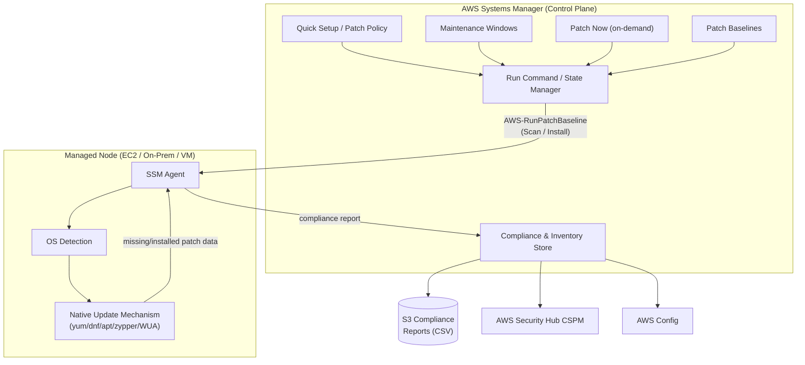
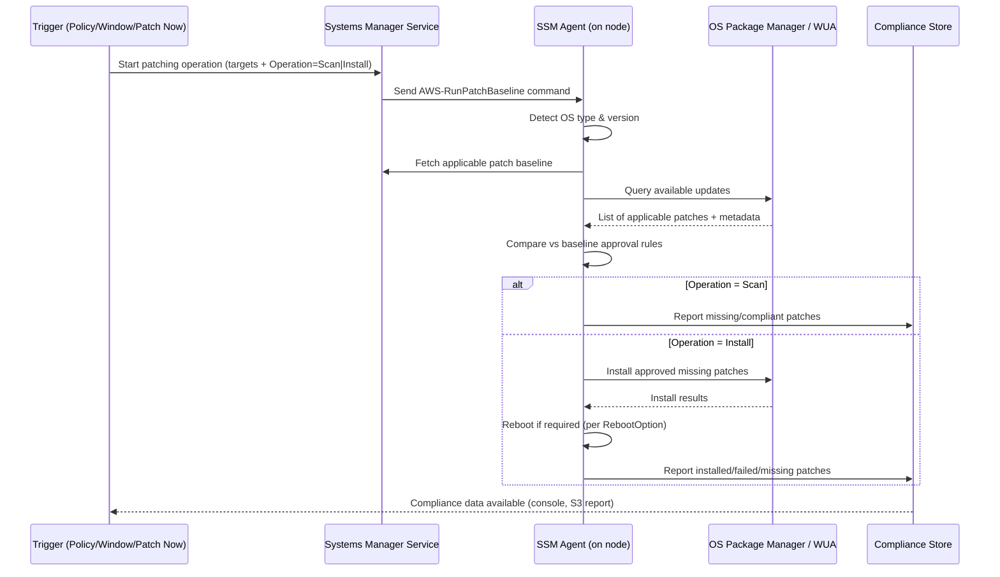
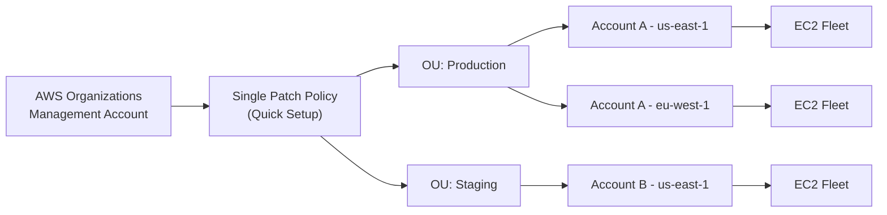

# AWS Systems Manager Patch Manager — Complete Guide

A single-file reference covering concepts, internals, architecture, console setup, verification, and troubleshooting for AWS Systems Manager (SSM) Patch Manager.

---

## Table of Contents

1. [Introduction to Patch Manager](#1-introduction-to-patch-manager)
2. [What Is Patching?](#2-what-is-patching)
3. [Why Patching Is Important](#3-why-patching-is-important)
4. [How Patch Manager Works Internally](#4-how-patch-manager-works-internally)
5. [How SSM Agent Detects the Operating System](#5-how-ssm-agent-detects-the-operating-system)
6. [How Linux/Windows Detect Available Updates](#6-how-linuxwindows-detect-available-updates)
7. [Patch Baselines](#7-patch-baselines)
8. [Patch Policies](#8-patch-policies)
9. [Scan vs Install](#9-scan-vs-install)
10. [Architecture Diagrams](#10-architecture-diagrams)
11. [Step-by-Step AWS Console Setup](#11-step-by-step-aws-console-setup)
12. [Verification](#12-verification)
13. [Troubleshooting](#13-troubleshooting)

---

## 1. Introduction to Patch Manager

**Patch Manager** is a capability of **AWS Systems Manager** that automates the process of patching managed nodes — EC2 instances, on‑premises servers, VMs, and edge devices — with security-related and other updates. It works across Windows Server, multiple Linux distributions, and macOS, letting you patch both operating systems and (on Windows, Microsoft-released) applications.

Instead of logging into every server to run `yum update`, `apt upgrade`, or Windows Update, you define **rules** (patch baselines or patch policies) once, and Patch Manager applies them consistently across your fleet — with reporting, scheduling, and rollback-friendly controls like maintenance windows and rate limits.

Key things Patch Manager gives you:

- **Centralized, agent-based control** — no inbound SSH/RDP required; the SSM Agent communicates outbound over HTTPS (443).
- **Fleet-wide consistency** — the same baseline/policy applies to every instance in a patch group or organization.
- **Compliance visibility** — see exactly which nodes are missing which patches, and export reports to Amazon S3.
- **Scale** — a single patch policy can cover every account and Region in an AWS Organization.

---

## 2. What Is Patching?

**Patching** is the process of applying updates ("patches") released by an operating system or software vendor to fix:

- **Security vulnerabilities** (e.g., a CVE that allows remote code execution)
- **Bugs** that cause crashes, data corruption, or incorrect behavior
- **Missing features or compatibility fixes**

A patch can be as small as a single library update (e.g., `openssl` on Linux) or as large as a cumulative update / service pack (Windows). Patches are typically categorized by:

- **Classification** — Security, Bugfix, Enhancement, Critical, Rollup, etc.
- **Severity** — Critical, Important, Moderate, Low (naming varies by OS vendor).
- **Release date** — used for "auto-approve N days after release" rules.

---

## 3. Why Patching Is Important

| Reason | Explanation |
|---|---|
| **Security** | Unpatched systems are the #1 entry point for exploits. Most breaches exploit *known* vulnerabilities for which a patch already exists. |
| **Compliance** | Standards like PCI-DSS, HIPAA, SOC 2, and FedRAMP require documented, timely patching with audit trails. |
| **Stability** | Bug fixes and kernel/driver updates prevent crashes, memory leaks, and performance regressions. |
| **Operational risk reduction** | Automating patching removes human error and inconsistent manual processes across large fleets. |
| **Reduced attack surface over time** | Regular patch cadence keeps the gap between "vulnerability disclosed" and "vulnerability fixed" as small as possible. |

Unpatched, internet-facing systems are routinely scanned and exploited within hours to days of a CVE's public disclosure — which is why automated, scheduled patching (rather than ad-hoc manual patching) is considered a baseline security control.

---

## 4. How Patch Manager Works Internally

At a high level, a patching operation flows like this:

1. **Trigger** — A patch policy schedule, a maintenance window, or an on-demand "Patch Now" action starts an operation.
2. **Target resolution** — Systems Manager resolves the target managed nodes (by instance ID, tag, patch group, resource group, or Organizations OU/account/Region scope).
3. **Command dispatch** — Systems Manager sends the `AWS-RunPatchBaseline` SSM document (a Run Command document) to the SSM Agent on each targeted node, with an `Operation` parameter of `Scan` or `Install`.
4. **Agent execution (per node)**:
   - The SSM Agent identifies the node's **operating system and version**.
   - It looks up (or receives) the **patch baseline** registered for that node's **patch group** (or the one defined in the patch policy).
   - It queries the OS's native package manager / update service to get the list of applicable and already-installed patches.
   - It compares available patches against the baseline's **approval rules** and **approved/rejected patch lists** to compute the set of *approved, missing* patches.
   - Depending on `Operation`:
     - `Scan` — reports missing patches only, changes nothing.
     - `Install` — installs the approved missing patches using the OS's native tooling, then reboots if required (based on the `RebootOption` parameter).
5. **Result reporting** — The agent reports patch state back to the Systems Manager service, which stores it as **compliance data** (`AWS/PatchCompliance` and `AWS/PatchState` inventory types) with a **capture time** representing a point-in-time snapshot.
6. **Aggregation** — The Patch Manager Dashboard, Compliance view, and optional CSV export to S3 aggregate this per-node data across the whole fleet.

Important internal facts:

- AWS does **not** pre-test patches before making them available in Patch Manager — approval logic is entirely defined by *your* baseline.
- Patch Manager does **not** perform major-version OS upgrades (e.g., RHEL 7 → RHEL 8, Windows Server 2016 → 2019) — only in-version patching (and, for some Linux distros, minor version upgrades).
- Compliance is defined **relative to your baseline**, not by AWS or the OS vendor — "compliant" means "matches your rules," not "guaranteed secure."

---

## 5. How SSM Agent Detects the Operating System

The SSM Agent runs as a background service/daemon on the managed node and, during registration with the Systems Manager service (and again at each patching operation), determines:

- **Platform type** — Linux, Windows, or macOS
- **Platform name and version** — e.g., `Ubuntu 22.04`, `Amazon Linux 2023`, `Windows Server 2022 Datacenter`, `Red Hat Enterprise Linux 9.3`
- **Architecture** — x86_64, arm64, etc.

Detection mechanics differ per OS family:

- **Linux**: The agent reads standard OS-identification files/commands available on virtually all modern distributions, primarily `/etc/os-release` (and falls back to distro-specific files such as `/etc/redhat-release`, `/etc/system-release`, or `lsb_release` output on older systems) to determine the distribution ID and version.
- **Windows**: The agent queries the Windows registry / WMI for OS product name, build number, and edition (e.g., Datacenter vs. Standard) to construct the `Product` identifier (e.g., `WindowsServer2022`) used by patch baseline filters.
- **macOS**: The agent reads system version information (`sw_vers`-equivalent) to determine the macOS release.

This detected **`Product`** value is what patch baseline filters (`Key=PRODUCT`) match against — so a baseline rule scoped to `AmazonLinux2023` will only apply to nodes the agent identifies as that product, and a Windows-scoped baseline won't affect Linux nodes, and vice versa. This is also why a single patch baseline is created **per operating system type**.

This OS/version identity is reported to Systems Manager as part of the node's **Inventory** (`AWS:InstanceInformation`), which you can view in Fleet Manager or query via `describe-instance-information`.

---

## 6. How Linux/Windows Detect Available Updates

Once the OS type is known, Patch Manager delegates the actual "what's available and what's installed" question to each OS's **native update mechanism** — it does not maintain its own independent patch database that overrides the OS's own package system.

### Linux

| Distro family | Underlying tool used |
|---|---|
| Amazon Linux, Amazon Linux 2, RHEL, CentOS, Oracle Linux, Rocky Linux | `yum` / `dnf` |
| Amazon Linux 2023 | `dnf` with **versioned repositories** (for deterministic, repeatable patch sets) |
| Ubuntu, Debian | `apt` |
| SUSE Linux Enterprise Server (SLES) | `zypper` |

The SSM Agent invokes these package managers to:
1. Refresh the repository metadata (from whatever repos are configured on the instance — default distro repos, or a custom repository specified in the patch baseline's `Sources` block).
2. List packages with available updates and their **classification/severity metadata** (e.g., Amazon Linux advisories map to `Classification=Security`, `Severity=Critical/Important/...`, with associated CVE and advisory IDs such as `ALAS-2011-1`).
3. Compare that list against the baseline's approval rules to compute the missing/approved set.
4. On `Install`, call the package manager to install just those specific package versions.

### Windows

Windows Server updates are sourced through the **Windows Update Agent (WUA)** API — the same subsystem behind Windows Update / WSUS. Patch Manager:
1. Queries WUA for applicable updates (cumulative updates, security updates, Service Packs) along with their **KB number**, **MSRC severity** (Critical/Important/Moderate/Low), and **classification** (SecurityUpdates, CriticalUpdates, UpdateRollups, etc.).
2. Filters that list against the patch baseline's approval rules (`MSRC_SEVERITY`, `CLASSIFICATION`, `PRODUCT`, and explicit KB approve/reject lists).
3. On `Install`, downloads and installs the approved updates via WUA and reboots according to the `RebootOption` parameter if the update requires it.

### Key difference

Linux patch matching generally works at the **individual package/version level** (e.g., `bind-utils.x86_64:32:9.8.2-...`), while Windows patch matching works at the **KB/update level** (e.g., `KB2919355`) — which is why the approved/rejected patch list *formats* differ between the two.

---

## 7. Patch Baselines

A **patch baseline** is a configuration, scoped to one operating system type, that defines what "patch compliant" means for your nodes. Patch Manager compares what's installed on a node against the baseline to compute compliance and the missing-patch list.

A baseline consists of:

- **Approval rules** — one or more rule sets, each combining:
  - **Patch filters** (`Key=Values`) such as `CLASSIFICATION=SecurityUpdates`, `MSRC_SEVERITY=Critical,Important`, `SEVERITY=Critical`, `PRODUCT=AmazonLinux2023`.
  - **ApproveAfterDays** — auto-approve matching patches N days after release (a safety buffer to avoid "day zero" untested patches), or **ApproveUntilDate** for a fixed cutoff.
  - Optional `EnableNonSecurity` (Linux) to include non-security updates (bugfixes) in the approval logic.
- **Approved patches list** — explicit patch/KB IDs always approved, regardless of rules.
- **Rejected patches list** — explicit patch/KB IDs always excluded, with a `RejectedPatchesAction` of `ALLOW_AS_DEPENDENCY` or `BLOCK`.
- **Global filters** — patches matching these are excluded from consideration entirely (not even scanned/reported).
- **Sources** (Linux only) — custom repository configuration, useful for pinning specific repo versions (important for deterministic patching on Amazon Linux 2023).
- **Patch groups** — an optional tag-based mechanism (`Key = "Patch Group"` or `PatchGroup`) to associate a set of instances with a specific baseline (not used when patching is driven by *patch policies*, which have their own targeting model).

AWS provides **predefined (default) patch baselines** per OS as a starting point/example — AWS explicitly does **not** recommend relying on these as-is for production; you should build **custom baselines** to control exactly what "compliant" means for your organization.

---

## 8. Patch Policies

**Patch policies**, configured through **Quick Setup**, are the AWS-recommended way to configure patching (introduced to simplify what used to require manually wiring together maintenance windows, baselines, and patch group tags).

With a single patch policy you can:

- Define patching for **all accounts and Regions in an AWS Organization**, a subset of accounts/Regions, specific **Organizational Units (OUs)**, or a single account-Region pair.
- Set **separate schedules** for scanning and installing (e.g., scan nightly, install weekly during a maintenance window), using cron or rate expressions.
- Select or create the **patch baseline(s)** to apply, per OS type.
- Configure **rate control** (concurrency and error thresholds) to avoid patching too many instances at once.
- Attach **lifecycle hooks** — SSM documents that run before/after the patching operation (e.g., drain a load balancer, run smoke tests).
- Automatically enable prerequisites (IAM role/instance profile association, SSM Agent update) as part of setup.

**Patch groups are not used** with patch-policy-driven operations — targeting is handled by the policy's account/Region/OU/tag scope instead.

### Patch policies vs. maintenance windows vs. Patch Now

| Method | Scope | Recommended for |
|---|---|---|
| **Patch policy (Quick Setup)** | Multi-account, multi-Region, org-wide or scoped to OUs | Ongoing, centralized, recurring patch governance (recommended default) |
| **Host Management (Quick Setup)** | Org-wide | Scan-only visibility, cannot install patches |
| **Maintenance window** | Single account/Region | Custom scheduled tasks, fine-grained control, mixing patch tasks with other Run Command tasks |
| **Patch Now (on-demand)** | Single account/Region | Emergency/ad-hoc patch runs outside the normal schedule |

---

## 9. Scan vs Install

Every patching operation runs as one of two modes, set via the `Operation` parameter of the `AWS-RunPatchBaseline` document:

### Scan
- Compares installed patches against the baseline.
- **Reports only** — produces a compliance summary (missing/installed/not-applicable/failed counts) without changing the system.
- Ideal for: nightly compliance visibility, pre-change auditing, dashboards, alerting on drift.

### Scan and Install (Install)
- Performs the same comparison, then **actually installs** every approved, missing patch using the OS's native package manager or Windows Update Agent.
- May trigger a **reboot**, controlled by the `RebootOption` parameter:
  - `RebootIfNeeded` (default) — reboot only if the installed patch requires it.
  - `NoReboot` — never reboot automatically (you handle reboots separately, e.g., via a controlled maintenance process).
- Ideal for: scheduled maintenance windows where downtime/reboot is acceptable.

**Best practice pattern:** run `Scan` frequently (e.g., daily) for visibility, and run `Scan and install` on a controlled cadence (e.g., weekly, in a maintenance window) so installs are predictable and reboots are planned — often combined with blue/green or Auto Scaling group instance-refresh strategies for zero-downtime patching of critical fleets.

---

## 10. Architecture Diagrams

### 10.1 High-level component architecture



### 10.2 Patching operation sequence



### 10.3 Multi-account / multi-Region patch policy scope



---

## 11. Step-by-Step AWS Console Setup

### Prerequisites

- Managed nodes need the **SSM Agent** installed and running (pre-installed on most Amazon Machine Images).
- Each node needs an **IAM role/instance profile** with the `AmazonSSMManagedInstanceCore` policy (or equivalent) attached, so the agent can communicate with the Systems Manager service.
- Outbound HTTPS (443) connectivity to Systems Manager/EC2/S3 endpoints (directly, via NAT, or via VPC interface endpoints for private subnets).
- The node must appear as a **Managed Node** in Fleet Manager before it can be patched.

### Option A — Recommended: Patch Policy via Quick Setup

1. Open the **AWS Systems Manager console** → **Quick Setup** (or **Patch Manager** → **Setup Patch Policy**).
2. Choose **Create** and select **Patch Policy** as the configuration type.
3. **Name** the policy (e.g., `prod-linux-weekly-patching`).
4. Choose **deployment scope**:
   - Current account only, or
   - Organization-wide, or
   - Specific OUs/accounts/Regions (requires AWS Organizations + a delegated administrator, if applicable).
5. Choose the **target nodes**: all managed nodes, or nodes matching specific **tags**.
6. Select or create the **patch baseline(s)** to use per OS type (or accept the AWS default baselines to start).
7. Configure the **schedule**:
   - Scan schedule (e.g., daily at 02:00 UTC).
   - Install schedule (e.g., weekly, Sunday 03:00 UTC) with a maintenance duration window.
8. Configure **rate control** (max concurrency, max error percentage) so patching rolls out gradually instead of hitting every instance at once.
9. Optionally attach **pre-patch / post-patch lifecycle hook documents**.
10. Enable **compliance reporting to S3** (optional) — pick a bucket and prefix.
11. Review and **Create**. Quick Setup automatically provisions the necessary IAM roles/associations if you allow it to.

### Option B — Manual setup with Maintenance Windows

1. **Create a custom patch baseline**: Console → **Patch Manager** → **Patch baselines** → **Create patch baseline**. Set OS type, approval rules (classification/severity, `ApproveAfterDays`), approved/rejected patch lists, and optional custom repository sources.
2. **Set the baseline as default** for that OS type (or register it to a **patch group**).
3. **Tag your instances** with `Key = "Patch Group"` (or `PatchGroup`) and a value, e.g., `Value = "WebServers"`.
4. **Register the patch group** to your custom baseline (console: on the baseline's detail page → **Patch groups** tab → **Modify patch groups**).
5. Go to **AWS Systems Manager** → **Maintenance Windows** → **Create maintenance window**. Define the schedule (cron/rate expression), duration, and cutoff.
6. **Register targets** — select instances by tag (e.g., `Patch Group = WebServers`) or instance IDs.
7. **Register a task** — choose **Run command** → document `AWS-RunPatchBaseline` → set `Operation` parameter to `Scan` or `Install`, set concurrency/error thresholds, and choose an IAM service role for the maintenance window.
8. Save. The window will trigger automatically on schedule.

### Option C — On-demand "Patch Now"

1. Console → **Patch Manager** → **Patch now**.
2. Choose **Operation**: `Scan` or `Scan and install`.
3. Choose **Reboot option**.
4. Select target nodes (instance IDs or tags).
5. Optionally attach lifecycle hook documents.
6. Choose an **IAM role** for the operation.
7. Click **Patch now** to run immediately (single account/Region only).

---

## 12. AWS CLI Commands

### Patch baselines

**Create a custom patch baseline (Linux example, Amazon Linux 2023):**
```bash
aws ssm create-patch-baseline \
    --name "AL2023-Security-7Day" \
    --description "Amazon Linux 2023 critical/important security updates, approved after 7 days" \
    --operating-system "AMAZON_LINUX_2023" \
    --approval-rules "PatchRules=[{PatchFilterGroup={PatchFilters=[{Key=CLASSIFICATION,Values=Security},{Key=SEVERITY,Values=Critical,Important}]},ApproveAfterDays=7}]"
```

**Create a Windows baseline:**
```bash
aws ssm create-patch-baseline \
    --name "Windows-Server-2022" \
    --description "Windows Server 2022, Critical and Important security updates" \
    --approved-patches "KB5034123" \
    --rejected-patches "KB5028185" \
    --rejected-patches-action "ALLOW_AS_DEPENDENCY" \
    --approval-rules "PatchRules=[{PatchFilterGroup={PatchFilters=[{Key=MSRC_SEVERITY,Values=[Important,Critical]},{Key=CLASSIFICATION,Values=SecurityUpdates},{Key=PRODUCT,Values=WindowsServer2022}]},ApproveAfterDays=5}]"
```

**Set a baseline as the default for its OS type:**
```bash
aws ssm register-default-patch-baseline --baseline-id "pb-0c10e65780EXAMPLE"
```

**List baselines (AWS-provided vs. your own):**
```bash
aws ssm describe-patch-baselines --filters "Key=OWNER,Values=Self"
```

**View a baseline's full details:**
```bash
aws ssm get-patch-baseline --baseline-id "pb-0c10e65780EXAMPLE"
```

### Patch groups (used only with maintenance-window-based patching, not patch policies)

**Tag an EC2 instance into a patch group:**
```bash
aws ec2 create-tags --resources "i-1234567890abcdef0" --tags "Key=PatchGroup,Value=WebServers"
```

**Register that patch group with a baseline:**
```bash
aws ssm register-patch-baseline-for-patch-group \
    --baseline-id "pb-0c10e65780EXAMPLE" \
    --patch-group "WebServers"
```

**View patch group → baseline mappings:**
```bash
aws ssm describe-patch-groups
```

### Scan and install operations

**Scan specific instances for compliance (no changes made):**
```bash
aws ssm send-command \
    --document-name "AWS-RunPatchBaseline" \
    --targets "Key=InstanceIds,Values=i-02573cafcfEXAMPLE,i-0471e04240EXAMPLE" \
    --parameters "Operation=Scan" \
    --timeout-seconds 600
```

**Scan by patch group tag:**
```bash
aws ssm send-command \
    --document-name "AWS-RunPatchBaseline" \
    --targets "Key=tag:PatchGroup,Values=WebServers" \
    --parameters "Operation=Scan" \
    --timeout-seconds 600
```

**Install approved patches on specific instances:**
```bash
aws ssm send-command \
    --document-name "AWS-RunPatchBaseline" \
    --targets "Key=InstanceIds,Values=i-02573cafcfEXAMPLE" \
    --parameters "Operation=Install,RebootOption=RebootIfNeeded" \
    --timeout-seconds 600
```

**Install patches across a whole patch group:**
```bash
aws ssm send-command \
    --document-name "AWS-RunPatchBaseline" \
    --targets "Key=tag:PatchGroup,Values=WebServers" \
    --parameters "Operation=Install" \
    --timeout-seconds 600
```

### Viewing available/applicable patches

**List available patches for a product/severity:**
```bash
aws ssm describe-available-patches \
    --filters "Key=PRODUCT,Values=AmazonLinux2023" "Key=SEVERITY,Values=Critical"
```

**List all patches defined/approved by a baseline (Windows only):**
```bash
aws ssm describe-effective-patches-for-patch-baseline --baseline-id "pb-0c10e65780EXAMPLE"
```

---

## 13. Verification

After running a `Scan` or `Install` operation, verify results using either the console or CLI.

### Console

1. **Patch Manager** → **Compliance** (or **Dashboard**) — shows counts of compliant/non-compliant nodes fleet-wide.
2. Click into a specific node to see the exact list of **missing**, **installed**, **failed**, and **not applicable** patches, plus the timestamp of the last operation (the "capture time" — always check this to confirm the report is current, not stale).
3. **Run Command** history — check the command's status (`Success`, `Failed`, `TimedOut`) and view stdout/stderr per instance for detailed error messages.

### CLI

**Per-node summary of patch state:**
```bash
aws ssm describe-instance-patch-states --instance-ids i-02573cafcfEXAMPLE
```
Key fields to check: `InstalledCount`, `MissingCount`, `FailedCount`, `CriticalNonCompliantCount`, `InstalledPendingRebootCount`, and `Operation` (confirms whether the last run was `Scan` or `Install`).

**Detailed patch list for one node:**
```bash
aws ssm describe-instance-patches --instance-id i-02573cafcfEXAMPLE
```
Each entry shows `Title`, `Classification`, `Severity`, `State` (`Installed`, `Missing`, `Failed`, `NotApplicable`, `InstalledPendingReboot`), and `InstalledTime`.

**Fleet-wide quick check (requires `jq`):**
```bash
aws ssm describe-instance-patch-states \
    --instance-ids $(aws ec2 describe-instances --region us-east-1 | jq '.Reservations[].Instances[] | .InstanceId' | tr '\n|"' ' ') \
    --output text \
    --query 'InstancePatchStates[*].{Instance:InstanceId,Missing:MissingCount,Failed:FailedCount,PendingReboot:InstalledPendingRebootCount}'
```

**Check the Run Command execution status directly:**
```bash
aws ssm list-command-invocations --command-id <command-id> --details
```

A node is considered fully compliant when `MissingCount`, `FailedCount`, and the various `NonCompliantCount` fields are all `0` for the relevant severities defined in your baseline.

---

## 14. Troubleshooting

| Symptom | Likely Cause | Fix |
|---|---|---|
| Instance doesn't appear in Patch Manager / Fleet Manager | SSM Agent not installed, not running, or missing IAM permissions | Verify the agent service is active; confirm the instance profile includes `AmazonSSMManagedInstanceCore`; check outbound connectivity to SSM endpoints (443) |
| `Scan` runs but reports 0 patches on a node with known-outdated packages | Wrong/empty patch baseline registered for that patch group, or overly strict approval rules | Check `describe-patch-groups` to confirm the correct baseline is mapped; review baseline's `ApprovalRules` and `ApproveAfterDays` |
| Patches show as "Missing" but never install even after `Install` runs | Patches rejected by baseline, dependency conflicts, or repo/network issues on the node | Check `describe-instance-patches` for `State=Failed` details; inspect Run Command output/stderr; verify the node can reach its package repos |
| Command times out | `--timeout-seconds` too low for a large install batch, or network/agent issue | Increase timeout; check agent logs (`/var/log/amazon/ssm/amazon-ssm-agent.log` on Linux, `%PROGRAMDATA%\Amazon\SSM\Logs` on Windows) |
| Instance stuck in `InstalledPendingReboot` | `RebootOption=NoReboot` was used, or the scheduled reboot hasn't occurred | Manually trigger a reboot, or rerun with `RebootIfNeeded`, or schedule a follow-up window |
| Patch policy doesn't apply to some accounts in the OU | Delegated administrator/trusted access with AWS Organizations not fully configured, or account outside targeted OU scope | Re-check the policy's deployment scope in Quick Setup; confirm AWS Organizations trusted access for Systems Manager is enabled |
| Compliance data looks stale | You're viewing an old `Scan` result — Patch Manager reports are point-in-time snapshots | Check the **capture time**; rerun `Scan` to refresh before relying on the numbers |
| Windows install fails with "reboot required but blocked" | Reboot suppressed by policy or another process holding a reboot lock | Confirm no conflicting reboot-suppression GPOs; check for pending reboots from unrelated Windows Update activity |
| Custom repository patches not detected (Linux) | `Sources` block in the custom baseline misconfigured, or repo unreachable from the instance | Validate the baseline's `Sources.Configuration` syntax; test repo reachability directly on the instance (`yum repolist`, `apt-get update`) |
| SSM Agent itself out of date | Older agent versions may lack support for newer OS versions or patch baseline features | Update the agent via the `AWS-UpdateSSMAgent` document, or enable auto-update in Quick Setup |

**General diagnostic order:**
1. Confirm the node is a **Managed Node** with a recent "Last ping" time.
2. Confirm the correct **baseline/policy** is registered to that node.
3. Run a **manual `Scan`** via Patch Now and inspect Run Command output.
4. Check **agent logs** on the instance for low-level errors.
5. Cross-check **network/IAM** prerequisites if the agent isn't communicating at all.

---

