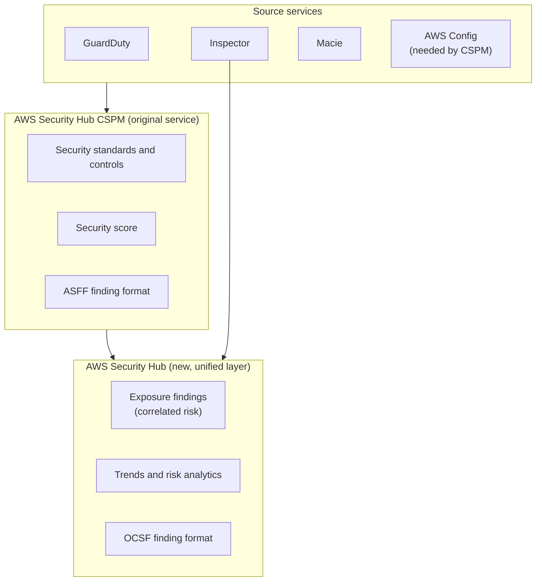
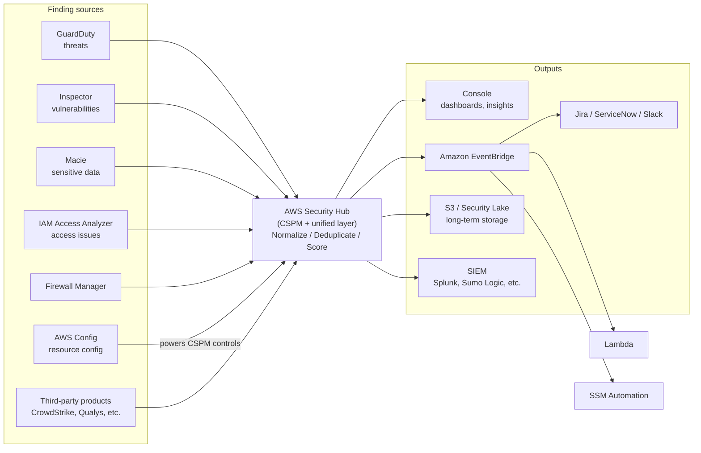
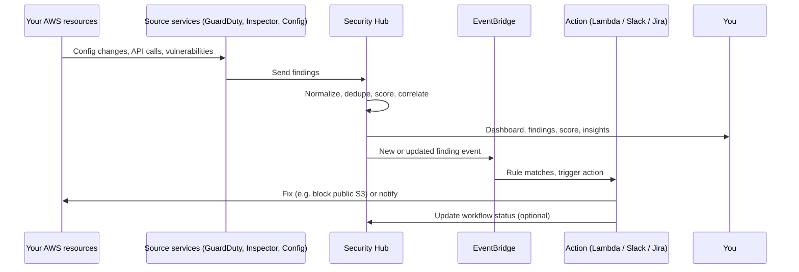
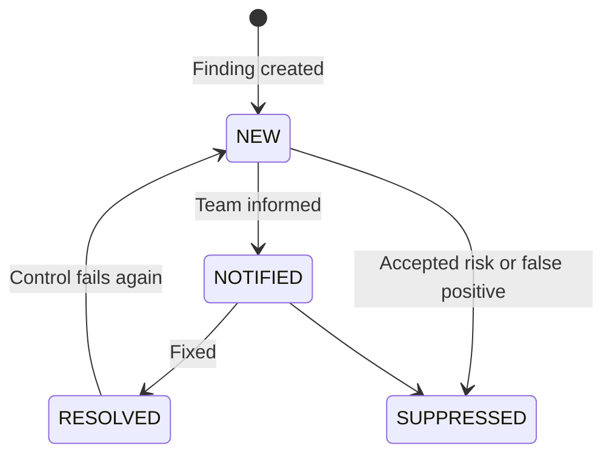
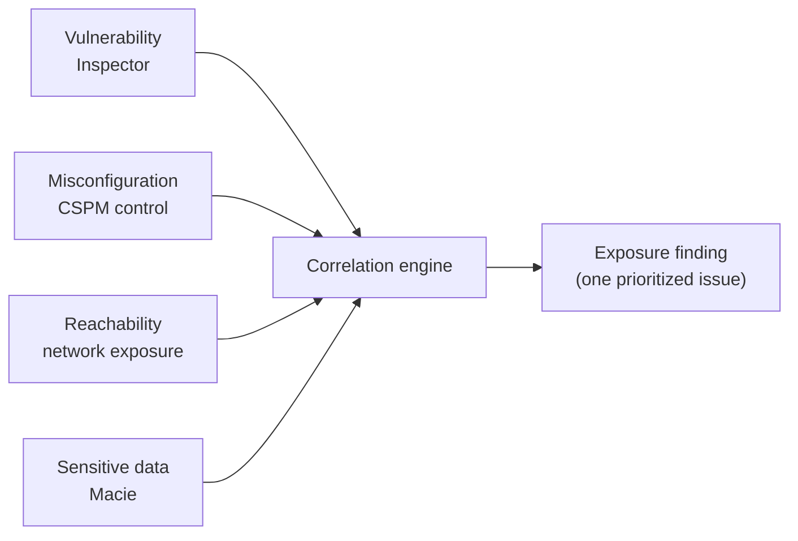
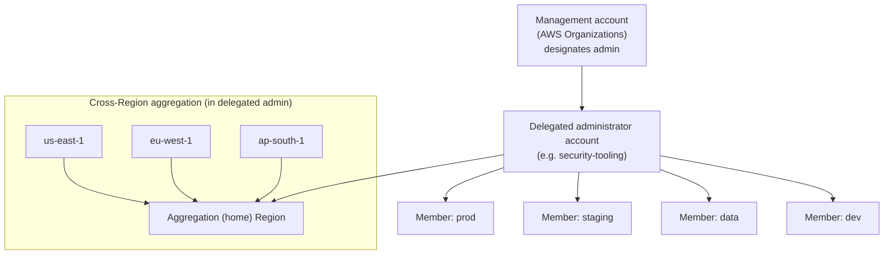
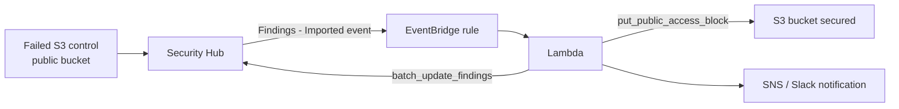
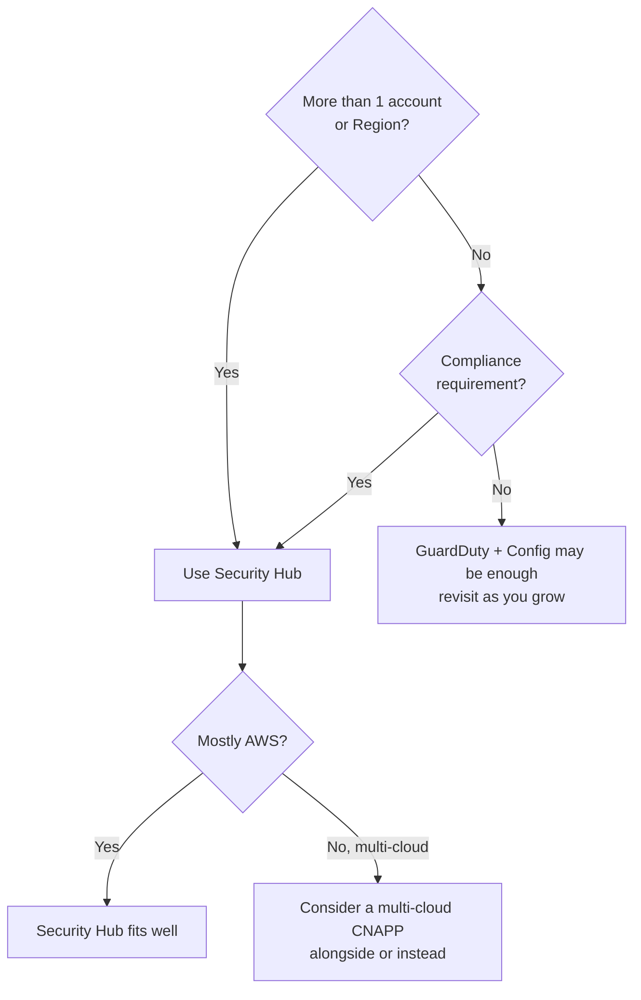

# AWS Security Hub: End-to-End Learning Guide

> **Level:** Beginner → Interview-ready → Hands-on
> **Read order:** Scenario → Concepts → Architecture → Features → Multi-account → Automation → Cost → Pros/Cons → When to use → Labs → Troubleshooting → Interview Q&A
> **Legend:** ⚠️ = verify against current AWS docs before relying on it (AWS changes this service often).

---

## Table of Contents

1. [The Problem (Scenario)](#1-the-problem-scenario)
2. [What Is AWS Security Hub?](#2-what-is-aws-security-hub)
3. [Two Layers: Security Hub vs Security Hub CSPM](#3-two-layers-security-hub-vs-security-hub-cspm)
4. [Glossary (Plain English)](#4-glossary-plain-english)
5. [Architecture](#5-architecture)
6. [How It Works, Step by Step](#6-how-it-works-step-by-step)
7. [Security Hub CSPM Deep Dive](#7-security-hub-cspm-deep-dive)
8. [New Security Hub: Exposure Findings](#8-new-security-hub-exposure-findings)
9. [Multi-Account and Multi-Region](#9-multi-account-and-multi-region)
10. [Automation and Remediation](#10-automation-and-remediation)
11. [Pricing and Cost Control](#11-pricing-and-cost-control)
12. [Advantages](#12-advantages)
13. [Disadvantages and Limitations](#13-disadvantages-and-limitations)
14. [When to Use / When NOT to Use](#14-when-to-use--when-not-to-use)
15. [Security Hub vs Related Services](#15-security-hub-vs-related-services)
16. [Hands-On Labs](#16-hands-on-labs)
17. [Troubleshooting](#17-troubleshooting)
18. [Best Practices Checklist](#18-best-practices-checklist)
19. [Interview Q&A](#19-interview-qa)
20. [One-Page Cheat Sheet](#20-one-page-cheat-sheet)
21. [Things To Verify](#21-things-to-verify)

---

## 1. The Problem (Scenario)

### Meet ShopKart (fictional company)

ShopKart is an e-commerce startup on AWS. It started with 1 account and now has:

- **12 AWS accounts** (prod, staging, dev, data, shared-services, one per team)
- **3 Regions** (`ap-south-1`, `us-east-1`, `eu-west-1`)
- A mix of EC2, EKS, Lambda, RDS, and lots of S3 buckets
- A 4-person platform/security team, and a PCI-DSS audit in 8 weeks

### Monday, 9:40 AM: three things go wrong

| # | What happened | Why nobody noticed |
|---|---|---|
| 1 | A developer in the `data` account created an **S3 bucket with public read access** for a "quick test" and forgot about it. | Nobody was watching S3 settings across 12 accounts. |
| 2 | An EC2 instance in `prod` has a **critical CVE** *and* a security group open to `0.0.0.0/22`... *and* an IAM role with admin rights. | Inspector flagged the CVE (Medium in isolation). The SG issue lived in Config. The IAM issue lived in Access Analyzer. Nobody connected the dots. |
| 3 | The auditor emails: *"Show me continuous PCI-DSS compliance evidence for all accounts."* | The team has screenshots and spreadsheets. |

### Why the current setup fails

To investigate, the team opens a different console for each question:

```text
GuardDuty  ->  "Is someone attacking us?"
Inspector  ->  "Do we have vulnerable software?"
Macie      ->  "Is sensitive data exposed?"
Config     ->  "Which resources violate rules?"
Access Analyzer -> "Who can access what?"
Firewall Manager -> "Are firewall policies applied?"
```

Times 12 accounts, times 3 Regions. That is a lot of tabs.

**The real problems:**

1. **Fragmentation.** Findings are scattered across services, accounts, and Regions.
2. **No common format.** Every tool has its own fields and severity wording.
3. **No prioritization.** 4,000 findings, no idea which 10 matter.
4. **No compliance score.** "Are we PCI compliant?" has no quick answer.
5. **No automation hook.** Even when you find a problem, fixing it is manual.
6. **Missing context.** Individually "medium" issues can combine into a critical attack path.

> **Security Hub exists to solve exactly this.** Keep ShopKart in mind; we'll come back to it at the end of each section.

---

## 2. What Is AWS Security Hub?

### The simple analogy

Think of an **airport security control room**.

- Individual scanners (X-ray, metal detectors, CCTV, passport control) = GuardDuty, Inspector, Macie, Config...
- The **control room** where all screens are shown together, alerts are ranked, and a supervisor can dispatch a response = **Security Hub**.

Security Hub is mostly **not** the scanner. It is the control room that collects, organizes, scores, and triggers action. (Exception: its CSPM layer *does* evaluate resource configuration against security controls.)

### One-line definition

> **AWS Security Hub is a cloud security service that aggregates security findings from AWS and partner tools into one place, checks your resources against security standards, and (in its newer form) correlates signals to show the exposures that matter most.**

### What it gives you

| Capability | Plain English |
|---|---|
| **Aggregation** | One place for findings from many tools |
| **Normalization** | All findings in a common format, so they can be filtered and automated |
| **Compliance checks** | Continuous checks against standards like CIS, PCI-DSS, NIST, and AWS's own best practices |
| **Scoring** | A pass/fail percentage per standard |
| **Prioritization** | Severity labels, and (new) exposure-based prioritization |
| **Automation hooks** | EventBridge integration for alerts and auto-remediation |
| **Multi-account / multi-Region view** | Organization-wide visibility from one admin account |

---

## 3. Two Layers: Security Hub vs Security Hub CSPM

AWS changed the product. What used to be called just "Security Hub" is now **Security Hub CSPM**, and the new **Security Hub** builds on top of it. Most older tutorials, blogs, and interview answers describe CSPM.



### Side-by-side

| | **Security Hub CSPM** (the classic) | **Security Hub** (the new layer) |
|---|---|---|
| Main job | Posture checks + findings aggregation + compliance scoring | Unified view, correlation, exposure prioritization |
| Finding format | ASFF | OCSF |
| Needs AWS Config? | **Yes** (for most controls) | Not itself, but its features need CSPM + Inspector enabled |
| Key outputs | Controls pass/fail, security score, findings list | Exposure findings, trends, risk analytics |
| Pricing | Per check + per finding ingested | Consolidated per-resource pricing ⚠️ |
| Can run together? | **Yes**, they can run side by side. Enabling the new Security Hub auto-enables CSPM in the account. | |

**How to say it in an interview:**
*"Security Hub CSPM is the original posture and aggregation service. The newer Security Hub builds on it, adding OCSF-based findings and exposure analytics that correlate signals from CSPM, Inspector and other services."*

> **ShopKart check:** Problem #2 (CVE + open SG + admin role) is exactly what exposure findings are designed to surface as one critical item instead of three unrelated mediums.

---

## 4. Glossary (Plain English)

| Term | Meaning |
|---|---|
| **Finding** | One record saying "this resource has this security issue". |
| **Control** | One specific check, e.g. "S3 buckets should block public access". |
| **Standard** | A bundle of controls, e.g. CIS, PCI-DSS, NIST 800-53, FSBP. |
| **FSBP** | AWS Foundational Security Best Practices. AWS's own baseline standard. |
| **Compliance status** | PASSED / FAILED / WARNING / NOT_AVAILABLE for a control on a resource. |
| **Severity** | INFORMATIONAL / LOW / MEDIUM / HIGH / CRITICAL. |
| **ASFF** | AWS Security Finding Format (JSON). Used by CSPM. |
| **OCSF** | Open Cybersecurity Schema Framework. Vendor-neutral format used by the new Security Hub. |
| **Workflow status** | Your remediation tracking on a finding: NEW / NOTIFIED / SUPPRESSED / RESOLVED. |
| **Record state** | Whether the finding is ACTIVE or ARCHIVED. |
| **Insight** | A saved query/grouping of findings (e.g. "resources with most HIGH findings"). |
| **Security score** | Percentage of controls passing, per standard (and overall). |
| **Aggregation Region** | The one Region where findings from other Regions are collected. |
| **Delegated administrator** | A member account in AWS Organizations that manages Security Hub for the whole org. |
| **Central configuration** | Admin-pushed policies that control which standards/controls are on for which accounts/OUs. |
| **Automation rule** | A rule that automatically modifies findings as they arrive (suppress, change severity, add note). |
| **Custom action** | A console button that sends selected findings to EventBridge. |
| **Exposure finding** | (New) A correlated finding showing a resource is actually exposed to risk, built from several signals. |
| **Integration** | A source (or destination) of findings: AWS service or third-party product. |

---

## 5. Architecture

### 5.1 High-level picture



### 5.2 Text version (if Mermaid doesn't render)

```text
 GuardDuty  Inspector  Macie  Access Analyzer  Firewall Mgr  Config  Partners
     \          |        |          |              |           |       /
      +---------+--------+----------+--------------+-----------+------+
                                    |
                          +---------v----------+
                          |   AWS SECURITY HUB |
                          | normalize, dedupe, |
                          | score, correlate   |
                          +----+----+----+-----+
                               |    |    |
                  Console  EventBridge  S3/Security Lake / SIEM
                               |
                       Lambda / SSM / Slack / Jira
```

### 5.3 Key architectural facts

- **Security Hub is Regional.** Enabling it in one Region does nothing for the others.
- **Findings come in via integrations**, not agents. Nothing to install.
- **Source services must be enabled separately.** Security Hub does not turn on GuardDuty or Inspector for you (it ingests what they produce).
- **For CSPM controls, AWS Config recording must be on** in that Region.

---

## 6. How It Works, Step by Step



### In words

1. **Enable** Security Hub (and CSPM) in a Region.
2. **Enable source services** (GuardDuty, Inspector, Macie, Access Analyzer) and **AWS Config** (needed for CSPM).
3. **Pick standards.** FSBP is the usual baseline.
4. **CSPM evaluates** resources continuously. Some controls run when a resource changes, others on a periodic schedule.
5. **Findings flow in**, get normalized (ASFF for CSPM, OCSF for the new layer), deduplicated, and scored.
6. **You triage** in the console: filter, group, use Insights.
7. **Automation** (rules / EventBridge) suppresses noise, notifies, or remediates.
8. **You track** workflow status until findings are RESOLVED, or SUPPRESSED if accepted risk.
9. **Report** the security score and trends to leadership/auditors.

> **ShopKart check:** Problems #1 (public bucket) and #3 (audit evidence) are covered by steps 4, 6, 9. A failed S3 control shows up within minutes to hours, and the PCI standard score gives the auditor continuous evidence.

---

## 7. Security Hub CSPM Deep Dive

### 7.1 Standards

| Standard | Use it when |
|---|---|
| **AWS Foundational Security Best Practices (FSBP)** | Default baseline for almost everyone |
| **CIS AWS Foundations Benchmark** | Industry-recognized hardening benchmark |
| **PCI DSS** | You handle payment card data |
| **NIST SP 800-53 Rev. 5** | US government / regulated environments |
| **NIST SP 800-171** | Protecting controlled unclassified info (US gov contractors) |
| **AWS Resource Tagging Standard** | Enforcing tag hygiene |
| **Service-managed standards** (e.g. Control Tower) | Managed by another AWS service |

⚠️ Multiple versions exist for CIS and PCI DSS and new ones get added. Check the console for the current list. Don't enable overlapping standards "just because" (see cost).

### 7.2 Controls

- A **control** is one check, e.g. `S3.2` "S3 general purpose buckets should block public read access", `IAM.6` "Hardware MFA should be enabled for the root user".
- One control can belong to several standards. Security Hub shows each control once under the consolidated control view.
- You can **disable** controls that don't apply (e.g. a control about a service you don't use) and document why.
- Some controls accept **custom parameters** (e.g. maximum age for access keys).

### 7.3 Why AWS Config matters

Most CSPM controls are backed by **AWS Config rules** that Security Hub manages for you.

- Config must be **enabled and recording** in each Region (including relevant resource types).
- For global resources like IAM, record them in at least one Region.
- Result: **Config costs are part of your Security Hub cost story.**

### 7.4 Severity levels

| Label | Meaning (rough guide) |
|---|---|
| CRITICAL | Fix now, likely actively exploitable or severe exposure |
| HIGH | Fix soon |
| MEDIUM | Plan a fix |
| LOW | Fix when convenient |
| INFORMATIONAL | No issue found / FYI |

### 7.5 Compliance status of a control

`PASSED` · `FAILED` · `WARNING` · `NOT_AVAILABLE`

### 7.6 Security score

```text
Score = passed controls / (passed + failed controls) x 100
```

Calculated per standard, and also as an overall score. Disabled controls and controls with no data don't count. Use the score for **trend direction** rather than treating a single number as the truth. One failed control on 5,000 resources hurts the same as one failed control on 1 resource, depending on how it's counted.

### 7.7 Finding lifecycle



There are two separate ideas people mix up:

| Field | What it tracks | Values |
|---|---|---|
| `Workflow.Status` | **Your** remediation progress | NEW, NOTIFIED, SUPPRESSED, RESOLVED |
| `RecordState` | Whether the finding is still current | ACTIVE, ARCHIVED |

⚠️ ASFF also has an older, deprecated `WorkflowState` field with different values. Use `Workflow.Status`.

A finding fixed at the source usually flips its **compliance status to PASSED** and is eventually archived automatically. `Workflow.Status` is what a human sets.

### 7.8 What an ASFF finding looks like (trimmed)

```json
{
  "SchemaVersion": "2018-10-08",
  "Id": "arn:aws:securityhub:ap-south-1:111122223333:subscription/aws-foundational-security-best-practices/v/1.0.0/S3.2/finding/abcd-1234",
  "ProductArn": "arn:aws:securityhub:ap-south-1::product/aws/securityhub",
  "GeneratorId": "aws-foundational-security-best-practices/v/1.0.0/S3.2",
  "AwsAccountId": "111122223333",
  "Title": "S3 general purpose buckets should block public read access",
  "Severity": { "Label": "CRITICAL" },
  "Compliance": { "Status": "FAILED" },
  "Workflow": { "Status": "NEW" },
  "RecordState": "ACTIVE",
  "Resources": [
    { "Type": "AwsS3Bucket", "Id": "arn:aws:s3:::shopkart-data-test", "Region": "ap-south-1" }
  ]
}
```

Fields worth memorizing: `Id`, `ProductArn`, `AwsAccountId`, `Severity.Label`, `Compliance.Status`, `Workflow.Status`, `RecordState`, `Resources[]`.

### 7.9 Insights

Saved queries over findings. AWS ships managed insights (e.g. "resources with the most failed controls", "top accounts by findings"). You can build custom ones, such as *"HIGH+ findings, workflow NEW, in prod accounts, grouped by resource"*.

### 7.10 Finding retention

Findings aren't kept forever (⚠️ roughly 90 days after last update, check docs). For audit history, **export findings** to S3 or Security Lake via EventBridge or an integration.

---

## 8. New Security Hub: Exposure Findings

### The idea

Old way: *"Instance has a CVE (Medium). SG is wide open (Medium). Role is over-permissive (Medium)."* Three mediums nobody prioritizes.

New way: *"This internet-reachable instance has an exploitable vulnerability **and** a powerful role. This is one **Critical exposure**."*



### What's new

- **Exposure findings** correlating CSPM control checks, Inspector, and other services.
- **Contributing factors** grouped by type: reachability, vulnerability, sensitive data, misconfiguration.
- **Trends** over time (about 90 days on the exposure view ⚠️).
- **OCSF** as the finding format, so it works better with vendor-neutral tooling.
- **Least-privilege suggestions** for unused-permission findings (scoped-down replacement policy).
- **Pricing consolidation** across Inspector, GuardDuty and CSPM for the included capabilities.

### Prerequisites to remember

- Exposure features need **Security Hub CSPM and Amazon Inspector enabled**.
- The enhanced Security Hub itself doesn't need AWS Config, but CSPM (which it builds on) does.

---

## 9. Multi-Account and Multi-Region

### 9.1 The setup that real companies use



### 9.2 Delegated administrator

- Set from the **Organizations management account**.
- Best practice: use a dedicated **security tooling account**, not the management account.
- The delegated admin can auto-enable Security Hub for member accounts and see org-wide findings.

### 9.3 Central configuration

- The delegated admin creates **configuration policies**: which standards and controls are on, applied to specific accounts or OUs.
- Prevents drift where each account owner picks different controls.
- ⚠️ Check requirements: the aggregation setup is a prerequisite for central configuration. Read the current docs before planning.

### 9.4 Cross-Region aggregation

- Pick **one home Region**, link the others (all Regions, or selected ones).
- Findings, insights and control status roll up into the home Region.
- Not automatic. You must configure it.
- New Regions can be auto-linked if you choose "all Regions" mode.

### 9.5 Region considerations for ShopKart

Enable in every Region you **use**, and think about Regions you **don't** use. Attackers sometimes create resources in unused Regions. Detection there still needs Security Hub, GuardDuty and Config, or an SCP that denies those Regions entirely.

---

## 10. Automation and Remediation

Security Hub **shows** problems. You decide how much it **fixes**.

### 10.1 Three automation tools

| Tool | What it does | Needs code? |
|---|---|---|
| **Automation rules** | Modify findings automatically as they arrive: suppress, change severity, set workflow status, add a note | No |
| **Custom actions** | Human clicks a button, finding goes to EventBridge | Only for the target |
| **EventBridge rules** | Match findings (severity, control, account) and trigger Lambda / SSM / SNS / Slack / Jira | Usually yes |

### 10.2 Typical pipeline



### 10.3 Example EventBridge pattern

```json
{
  "source": ["aws.securityhub"],
  "detail-type": ["Security Hub Findings - Imported"],
  "detail": {
    "findings": {
      "Severity": { "Label": ["HIGH", "CRITICAL"] },
      "Compliance": { "Status": ["FAILED"] },
      "Workflow": { "Status": ["NEW"] },
      "RecordState": ["ACTIVE"]
    }
  }
}
```

### 10.4 Automation rule ideas (no code)

- Suppress findings from the `sandbox` account for a named control.
- Raise severity to CRITICAL for failed controls on resources tagged `env=prod` ⚠️ (check which tag-based criteria are supported).
- Add a note "Owner: payments-team" to findings from specific accounts.

### 10.5 Remediation warnings (read this)

- **Auto-remediation can break production.** Blocking public access on a bucket that serves a website will take the website down.
- Start with **notify only**, then auto-fix low-risk controls, then widen.
- Always log what the automation changed.
- AWS publishes a reference solution for automated response and remediation. Look it up before writing everything from scratch.

---

## 11. Pricing and Cost Control

⚠️ Always check the pricing page. Rates and models change, and the new Security Hub changed the model.

### 11.1 Model summary

| Layer | How you're charged |
|---|---|
| **Security Hub CSPM** | Per security check (per account, per Region) + per finding ingestion events, with a free tier and trial |
| **New Security Hub** | Consolidated per-resource pricing covering included capabilities across Inspector, GuardDuty and CSPM; extras (e.g. threat analytics, Lambda code scanning) priced as add-ons ⚠️ |
| **Everything else** | Capabilities not included in the Security Hub plan keep their own billing (GuardDuty, Inspector, Config, Macie) |

### 11.2 Hidden costs people forget

- **AWS Config** recording and rules
- **GuardDuty / Inspector / Macie** are separate services
- **Data transfer / S3 / Security Lake** if you export findings
- **Lambda, SNS, EventBridge** for automation (small, but nonzero)

### 11.3 How to keep it sane

1. Enable **only standards you need**. Overlapping standards duplicate many controls.
2. Roll out in **one account first**, wait a week, check Cost Explorer.
3. Disable controls that don't apply.
4. Don't enable in Regions you've blocked with an SCP.
5. Use **budgets and alerts** (AWS Budgets) on the security tooling account.
6. Scale up gradually, and **estimate**: `accounts x Regions x resources x standards`.

---

## 12. Advantages

| Advantage | Detail |
|---|---|
| **Single pane of glass** | One place instead of 6+ consoles |
| **Common finding format** | ASFF / OCSF enables filtering and automation |
| **Continuous compliance** | Scores update as resources change, not once a year |
| **Multi-account, multi-Region view** | Fits real AWS Organizations setups |
| **No agents to deploy** | Lightweight rollout |
| **Native automation** | EventBridge, automation rules, custom actions |
| **Exposure prioritization (new)** | Correlates signals instead of showing isolated mediums |
| **Partner ecosystem** | Many third-party products send/receive findings |
| **Audit-friendly** | Standards mapping and trend reporting |
| **Central policy** | Central configuration reduces drift |

## 13. Disadvantages and Limitations

| Disadvantage | Detail | Mitigation |
|---|---|---|
| **Depends on other services** | No GuardDuty/Inspector/Config = little to show | Enable the sources first |
| **Cost stacks across services** | Hub + Config + sources | Scope standards/Regions; track cost early |
| **Config dependency (CSPM)** | Extra setup and cost | Plan Config rollout first |
| **Initial finding flood** | Existing resources fail controls retroactively | Triage by severity, use automation rules |
| **No built-in fix** | You build remediation | Start with AWS reference solutions |
| **Setup planning** | Delegated admin, central config, aggregation take design | Follow AWS landing-zone guidance; plan before enabling |
| **Region-scoped by default** | Easy to miss Regions | Configure aggregation + enable everywhere |
| **Not every check is instant** | Periodic controls can lag | Don't treat it as a real-time alarm |
| **AWS-centric** | Weak fit for multi-cloud | Consider a multi-cloud CNAPP |
| **Findings aren't a workflow tool** | Weak for assigning owners/SLAs | Push to Jira/ServiceNow |
| **Naming/product confusion** | Hub vs CSPM, ASFF vs OCSF | Learn the split (Section 3) |
| **Score can mislead** | Percentage ignores blast radius | Use alongside severity and exposure |

> **Biggest real-world failure:** the tool works, but **nobody owns the findings.** No routing to teams, no SLAs, so the backlog just grows.

---

## 14. When to Use / When NOT to Use

### Use it when

- You have **multiple accounts and/or Regions** and need one view.
- You need **continuous compliance** evidence (PCI-DSS, CIS, NIST, SOC 2 prep).
- You already run GuardDuty/Inspector/Macie and want them consolidated.
- You want a **standard hook** for automation (EventBridge).
- A **SOC or platform team** will actually triage findings.
- You want **risk prioritization** across vulnerabilities and misconfigurations.

### Skip or delay it when

- **One small account, no compliance requirement.** GuardDuty plus a few Config rules may be enough.
- **Mostly multi-cloud.** An AWS-only view leaves gaps.
- **No one will look at the findings.** You'll pay for a dashboard nobody reads.
- You need **log analytics / threat hunting**. That's a SIEM job.
- You're only after **pre-deployment scanning** of IaC/containers. Use Trivy, Checkov, etc. in CI.

### Decision tree



### Alternatives and complements

| Tool | Role |
|---|---|
| **Prowler** | Open-source AWS (and multi-cloud) security checks |
| **Trivy / Checkov** | Shift-left scanning (images, IaC) in CI/CD |
| **Wiz / Prisma Cloud / Orca** | Commercial multi-cloud CNAPP |
| **SIEM (Splunk, Sentinel, etc.)** | Log analytics, correlation, hunting |

---

## 15. Security Hub vs Related Services

| Service | Purpose | Relationship |
|---|---|---|
| **GuardDuty** | Threat detection from logs/telemetry | Sends findings to Security Hub |
| **Inspector** | Vulnerability scanning (EC2, ECR, Lambda) | Sends findings; required for exposure features |
| **Macie** | Sensitive data discovery in S3 | Sends findings |
| **IAM Access Analyzer** | External/unused access | Sends findings |
| **Firewall Manager** | Central firewall policy management | Sends findings |
| **AWS Config** | Resource configuration tracking and rules | Powers CSPM controls |
| **Detective** | Investigation of findings (graph analysis) | Investigate Security Hub findings further |
| **Security Lake** | Security data lake (OCSF) | Long-term storage and analytics destination |
| **AWS Audit Manager** | Evidence collection for audits | Complements compliance reporting |
| **Trusted Advisor** | General best-practice checks incl. cost | Broader than security; different scope |

**Interview line:** *"GuardDuty detects threats, Inspector finds vulnerabilities, Config tracks configuration, Macie finds sensitive data. Security Hub aggregates all of that, runs posture controls, and prioritizes."*

---

## 16. Hands-On Labs

> **Cost warning:** Enabling Security Hub, Config, GuardDuty and Inspector can incur charges after free trials. Use a **sandbox account**, set a **budget alert**, and **clean up** at the end (Lab 6).

### Lab 0: Prerequisites

- An AWS sandbox account (or two, for the multi-account lab)
- Console access with permissions to use Security Hub, Config, EventBridge, Lambda, IAM and S3
- Region used in examples: `ap-south-1` (change as needed). Stay in one Region unless a lab says otherwise.

### Lab 1: Enable Config (required for CSPM controls)

Console path: **AWS Config → Get started / Set up** → record all resources (include global resources in one Region) → choose an S3 bucket → enable.

Check in the console: **AWS Config → Settings** shows the recorder as **Recording**.

### Lab 2: Enable Security Hub (CSPM) via console

1. Open **Security Hub** console in your Region.
2. Choose to enable it. When asked for standards, pick **FSBP** only.
3. Wait. The first evaluation can take some time before the score and findings appear.
4. Explore: **Summary**, **Security standards** (see score), **Controls**, **Findings**, **Insights**.

### Lab 3: Query and manage findings (console)

1. Open **Findings**. Add filters: **Severity label = CRITICAL**, **Record state = ACTIVE**, **Compliance status = FAILED**.
2. Open one finding and read: title, resource, severity, compliance status, remediation link.
3. Select a finding of low importance in your sandbox → **Actions / Workflow status** → set to **SUPPRESSED** and add a note (for example: "Accepted: sandbox bucket").
4. Go to **Controls**, open one control, and note which standards it belongs to.
5. Go to **Insights** and open a managed insight, then create a custom one (for example: HIGH+ findings, workflow NEW, grouped by resource).

### Lab 4: Cross-Region aggregation (console)

1. Decide your home Region (for example `ap-south-1`).
2. In that Region: **Security Hub → Settings → Regions** (or Configuration → Regions) → create an aggregation and choose to link **all Regions** (or select Regions).
3. Enable Security Hub in your other Regions.
4. Return to the home Region and check that findings from the linked Regions appear.

Note: the aggregation must be created from the home Region.

### Lab 5: Auto-remediate a public S3 bucket (EventBridge + Lambda)

**Goal:** when Security Hub reports a failed public-access control on an S3 bucket, a Lambda blocks public access.

**Step 1: Create a test bucket in the sandbox** and make it intentionally non-compliant (e.g. turn off Block Public Access on that bucket only). Do not make real data public.

**Step 2: Lambda (Python 3.12)**

```python
import boto3

s3 = boto3.client("s3")

def lambda_handler(event, context):
    for f in event["detail"]["findings"]:
        for r in f.get("Resources", []):
            if r.get("Type") != "AwsS3Bucket":
                continue
            bucket = r["Id"].split(":::")[-1]
            print(f"Blocking public access on {bucket}")
            s3.put_public_access_block(
                Bucket=bucket,
                PublicAccessBlockConfiguration={
                    "BlockPublicAcls": True,
                    "IgnorePublicAcls": True,
                    "BlockPublicPolicy": True,
                    "RestrictPublicBuckets": True,
                },
            )
    return {"status": "done"}
```

IAM permissions for the Lambda role (minimum): `s3:PutBucketPublicAccessBlock` on the target buckets, plus basic Lambda logging. Optionally `securityhub:BatchUpdateFindings` to mark findings.

**Step 3: EventBridge rule** using the pattern in Section 10.3. Narrow it for the lab by also matching the specific control ID or resource type to avoid surprises.

**Step 4: Test.** Wait for the control to evaluate (it can take a while), then watch CloudWatch Logs for the Lambda and check the bucket's Block Public Access setting.

**Step 5: Think like an engineer.** What breaks if this fires on the wrong bucket? Add an allow-list tag (e.g. `public-ok=true`) and test it.

### Lab 6: Cleanup (important)

In dependency order:

1. Delete the EventBridge rule, then the Lambda function, then the test buckets.
2. **Security Hub → Settings → General →** disable Security Hub in each Region you enabled it.
3. Stop the AWS Config recorder and delete the delivery channel if no longer needed.
4. Disable GuardDuty/Inspector if you enabled them just for this lab.

Check **Billing → Cost Explorer** the next day.

### Lab 7 (stretch): Org-wide

1. In the management account, designate a delegated admin for Security Hub.
2. In the delegated admin, enable auto-enable for new member accounts.
3. Create a central configuration policy applying FSBP to an OU.
4. Verify member accounts appear and findings roll up.

---

## 17. Troubleshooting

| Symptom | Likely cause | Fix |
|---|---|---|
| No findings at all | Source services (GuardDuty/Inspector/Macie) not enabled | Enable them; give it time |
| Controls show no data / NOT_AVAILABLE | AWS Config not enabled/recording in that Region | Enable Config recording |
| Some IAM controls missing | Global resource recording not enabled anywhere | Record global resources in one Region |
| Findings from other Regions missing | No aggregation Region linked | Create finding aggregator in home Region |
| Member accounts not showing | Delegated admin/Org integration not set, or members not enabled | Set up org integration; enable auto-enable |
| Huge finding count right after enabling | Retroactive evaluation of existing resources | Triage by severity; use automation rules |
| Cost jumped | Too many standards/Regions/accounts, Config rules | Scope down; check Cost Explorer by service |
| Finding fixed but still showing | Evaluation lag on periodic controls | Wait for next evaluation; check compliance status |
| EventBridge rule never fires | Rule in the wrong Region/account, or pattern too strict | Check Region; test with a sample event; loosen pattern |
| Lambda fires but nothing changes | Missing IAM permission or wrong resource ID parsing | Check CloudWatch Logs and role policy |
| Duplicate-looking findings | Same control in several standards | Use the consolidated control view |
| Exposure findings not appearing | Prerequisites (CSPM + Inspector) not enabled | Enable both |

---

## 18. Best Practices Checklist

**Foundation**
- [ ] Enable AWS Config recording in every Region you use
- [ ] Enable GuardDuty, Inspector (and Macie if you have sensitive S3 data)
- [ ] Use a **dedicated security tooling account** as delegated admin
- [ ] Enable Security Hub in all Regions you use; block unused Regions with an SCP

**Scope and cost**
- [ ] Start with FSBP; add other standards only for real compliance needs
- [ ] Disable non-applicable controls with documented reasons
- [ ] Set Budgets alerts on the security account

**Operations**
- [ ] Configure cross-Region aggregation
- [ ] Use central configuration policies for consistency
- [ ] Use automation rules to suppress known-accepted noise
- [ ] Route HIGH/CRITICAL to a ticketing or chat system with named owners
- [ ] Define SLAs per severity (e.g. Critical 24h, High 7d)
- [ ] Review the score and exposure trends weekly/monthly

**Automation**
- [ ] Notify first, auto-fix later
- [ ] Test remediations in sandbox; add allow-lists
- [ ] Log every automated change

**Governance**
- [ ] Export findings to S3/Security Lake for long-term retention
- [ ] Document risk acceptances (suppressions) with owner and expiry

---

## 19. Interview Q&A

**Q1. What is AWS Security Hub in one line?**
A unified security service that aggregates findings from AWS and partner tools, runs posture checks against standards (CSPM), and correlates signals into prioritized exposures.

**Q2. What is the difference between Security Hub and Security Hub CSPM?**
CSPM is the original posture/aggregation service (ASFF, controls, score, needs Config). The newer Security Hub builds on it with OCSF, exposure findings and trends, and consolidated pricing. They can run together.

**Q3. Does Security Hub replace GuardDuty or Inspector?**
No. They detect; Security Hub aggregates and prioritizes.

**Q4. What formats do findings use?**
ASFF for CSPM; OCSF for the new Security Hub.

**Q5. What's an exposure finding?**
A correlated finding that combines signals (reachability, vulnerability, misconfiguration, sensitive data) to show a resource is actually at risk.

**Q6. Why is AWS Config needed?**
Many CSPM controls are implemented as Config rules, so Config must be recording in the Region.

**Q7. How do you get multi-account visibility?**
Use AWS Organizations: designate a delegated administrator, auto-enable members, optionally apply central configuration policies.

**Q8. How do you get multi-Region visibility?**
Create a finding aggregator with a home Region and link the other Regions.

**Q9. What's the difference between `Workflow.Status` and `RecordState`?**
`Workflow.Status` is human remediation tracking (NEW, NOTIFIED, SUPPRESSED, RESOLVED); `RecordState` says whether the finding is active or archived.

**Q10. How would you auto-remediate a finding?**
EventBridge rule matching the finding (severity, control, resource type) → Lambda or SSM Automation → fix → update workflow status. Start with notify-only and test in a sandbox.

**Q11. What are automation rules?**
No-code rules that change findings as they arrive (suppress, change severity, add notes), used to cut noise.

**Q12. What's the biggest cost pitfall?**
Enabling all standards in all Regions and accounts, plus paying separately for Config and source services.

**Q13. What happens right after you enable it?**
A burst of findings, because existing resources are evaluated retroactively.

**Q14. Is it real-time?**
Not entirely. Some controls are change-triggered, others periodic; threat findings from GuardDuty arrive faster. Don't treat it as a pure real-time alarm.

**Q15. When would you NOT use it?**
Tiny single-account setups with no compliance need, multi-cloud-first estates, or when nobody will triage findings.

**Q16. How would you roll it out in a 50-account org?**
Dedicated security account as delegated admin → enable Config/GuardDuty/Inspector org-wide → Security Hub with FSBP via central configuration → aggregation Region → automation rules for noise → EventBridge to ticketing → dashboards → expand standards as compliance requires. Rolled out OU by OU.

**Q17. How do you present the score to leadership?**
Show trend over time and critical/high exposure counts. Avoid selling a single percentage as the whole truth.

---

## 20. One-Page Cheat Sheet

```text
WHAT      Security control room for AWS: aggregate + check + prioritize + trigger
TWO LAYERS  Security Hub (new: exposure, OCSF)  /  Security Hub CSPM (classic: controls, ASFF, score)
NEEDS     Source services (GuardDuty, Inspector, Macie...) + AWS Config (for CSPM)
FORMAT    ASFF (CSPM)  |  OCSF (new)
STANDARDS FSBP (baseline), CIS, PCI DSS, NIST 800-53 / 800-171, Tagging
SCORE     passed / (passed + failed) per standard
STATUS    Workflow.Status: NEW / NOTIFIED / SUPPRESSED / RESOLVED
          RecordState: ACTIVE / ARCHIVED
SEVERITY  INFORMATIONAL < LOW < MEDIUM < HIGH < CRITICAL
SCOPE     Regional by default -> aggregation Region + delegated admin
AUTOMATE  Automation rules (no code) | Custom actions | EventBridge -> Lambda/SSM
COST      Hub + Config + sources. Scope standards/Regions. Check pricing page.
PITFALLS  No owner for findings | initial flood | auto-remediation breaking prod | forgetting Regions
```

---

## 21. Things To Verify

Items marked ⚠️ above, collected so you can check them in the live docs:

- [ ] Current list and versions of supported standards
- [ ] Current pricing model/rates for Security Hub and Security Hub CSPM
- [ ] Findings retention period and archive behavior
- [ ] Exact prerequisites for central configuration and aggregation
- [ ] Which tag-based criteria automation rules support
- [ ] Region availability of the new Security Hub
- [ ] Exposure trend window (about 90 days) and available add-on plans

**Where to look:** AWS Security Hub User Guide, Security Hub pricing page, Security Hub FAQs, and the "AWS Security Finding Format" reference.

---

*Next steps for practice: do Labs 1-3 first, then 4-5. After that, redo the ShopKart scenario in your own words and explain how each of the three Monday problems would be caught and handled.*
